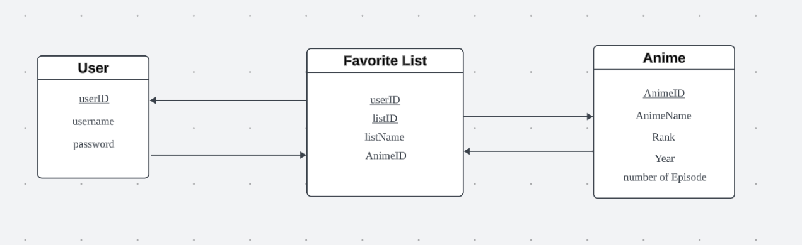

# IMDb Anime Dataset Analysis Platform
This is a full stack web application project I made with my friends Jiayin Meng, Minghao Shi and Boqin Yuan.

Video related to our project:   https://mediaspace.illinois.edu/media/t/1_tsjc3l00

## Introduction:
IMDb Anime Dataset Platform is an online database of anime-related information. The users could register their account and log in to the platform to search for the anime they want to watch and see the details (e.g. rating) of the anime. If the users love some specific anime, they could add them to their favorites so that they can check this anime later in their favorite anime list without searching.

For more details, please view our project proposal [here](https://docs.google.com/document/d/1Po8U-SgywcwDFIAYKNRANwdWjj6rEpnyhtdZcU9oOjE/edit?usp=sharing)

## Group Members and Roles:
- **Wentao Zhang:** Frontend/Backend Development, Database Management
- **Jiayin Meng:** Frontend/Backend Development
- **Minghao Shi:** Frontend Development, Data Processing
- **Boqin Yuan:** Data Processing, Machine Learning

## Technical architecture:



## Instructions:
1. Navigate to the following folder:
```
cd anime-dataset-analysis-platform/backend
```
2. Follow the [Readme](anime-dataset-analysis-platform/backend/README.md) to run the backend server to connect to the database.

3. Navigate to the following folder:
```
cd anime-dataset-analysis-platform
```
4. Follow the [Readme](anime-dataset-analysis-platform/README.md) to run the platform in development mode.

## Pipeline:

### Data scraping:

Use MAL API to scrap the dataset we want to use. We plan to use this API for specific data we want in the future. 

MAL API: https://myanimelist.net/apiconfig/references/api/v2#section/Authentication


Adherence to the PEP 8 and Airbnb Style Guides, utilization of pytest, flake8, ESLint, and coverage.py, and a strategic PR review process uphold our code and functional quality.

## Conclusion

Embark on this journey with us to unveil a comprehensive, insightful, and engaging platform making Japanese anime data accessible and insightful for all!

